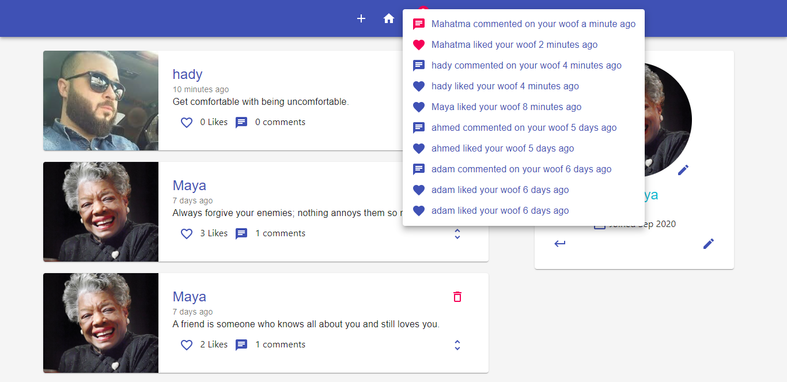
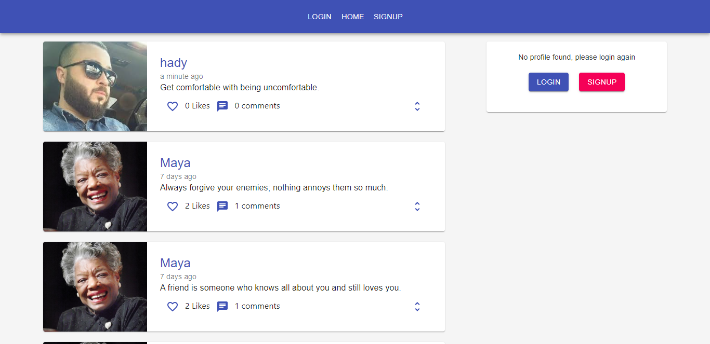
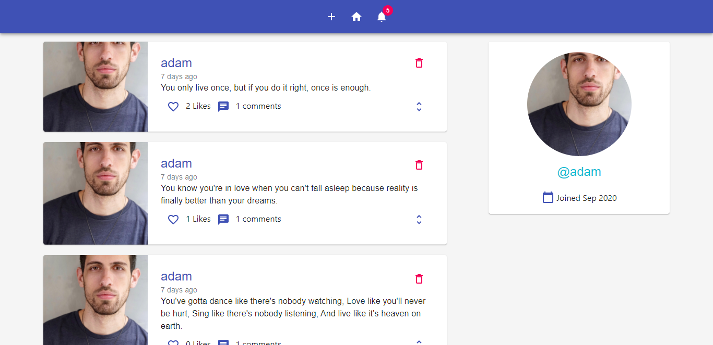
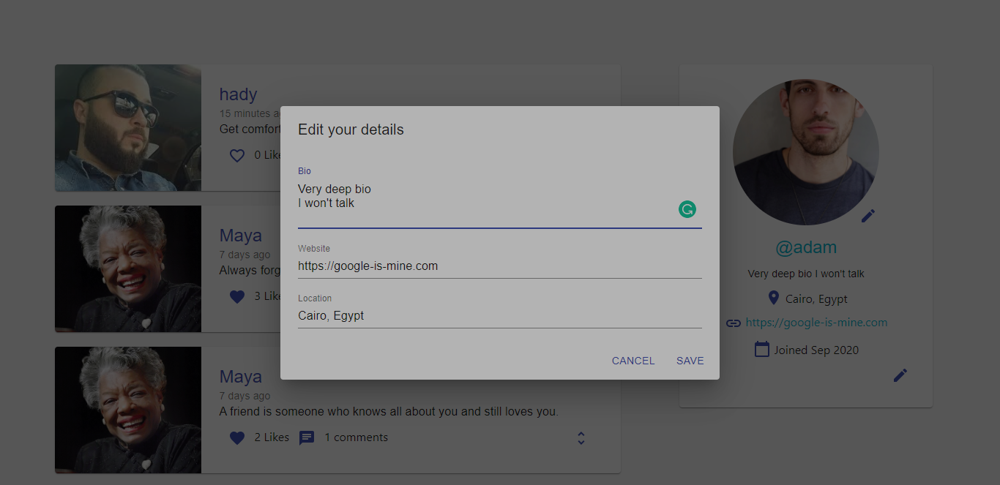
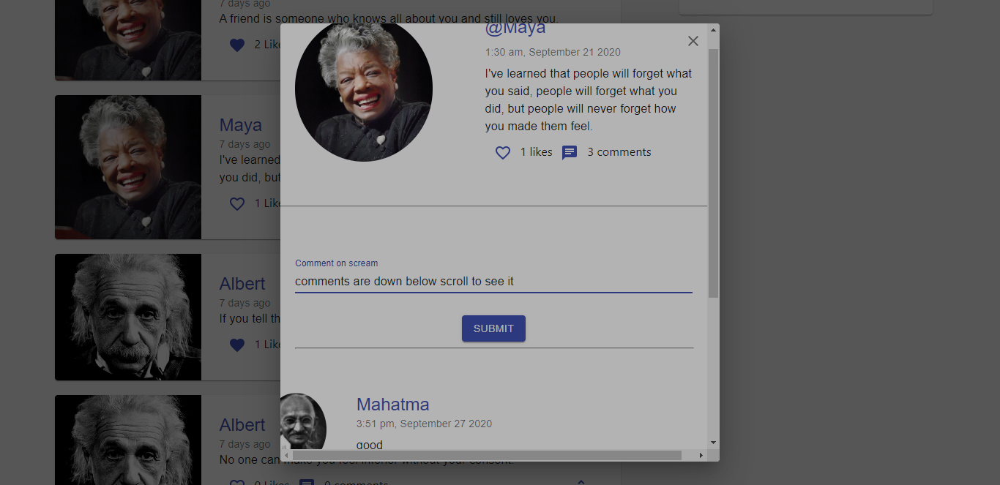
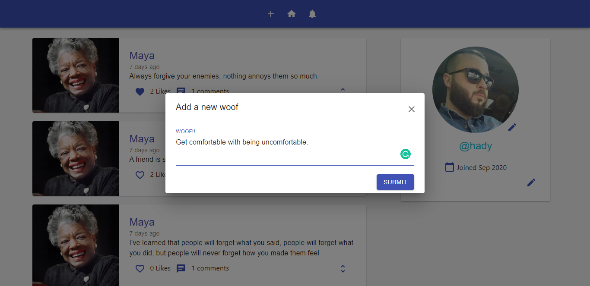

# Woofer API (Backend)

Woofer is a twitter-like application that allows you to post woofs (tweets), see woof details like comments likes, get notifications, see user profiles, edit profile, like and unlike, comment, and do the basic CRUD operations.

- Check out the deployed site [API - Backend](https://woofer-api.herokuapp.com/)

- If you are looking for the frontend repo, [click here](https://github.com/silvertechguy/woofer)

- Check out the deployed site [Frontend](https://woofer-official.herokuapp.com/)

- API Endpoints: [here](https://github.com/silvertechguy/woofer-api/blob/master/api-spec.md)

## Core Packages

1. express - create restful API server
2. pg - database management
3. jsonwebtoken - authentication
4. redis - fast memory storage to manage sessions using jwt
5. aws-sdk - amazon s3 to storage image

## Features

- Signup / Login
- Notifications 🔔
- View Profile
- Upload Photo
- Edit Profile
- New Woof (tweet)
- Like / UnLike
- Comment
- View Woof

## Watch this video on how to setup locally (up and running) using Docker

Click the YouTube link [here](https://www.youtube.com/watch?v=67pjjO0BddY) or the image down below
[](https://www.youtube.com/watch?v=67pjjO0BddY "Woofer API Backend Setup")

## Or you can read how to setup locally (up and running) using Docker

### Environmental variables setup

1. Create a .env file at the root directory
2. Copy whatever in the .env.example file in the project and paste it in the .env file you created (adjust anything if needed)
3. In order for image upload feature to work you have to fill in these values (you can leave it if you don't care about image uploading)

```javascript
AWS_ACCESS_KEY_ID=<YOUR_ACCESS_KEY_ID>
AWS_SECRET_ACCESS_KEY=<SECRET_ACCESS_KEY>
S3_BUCKET_NAME=<S3_BUCKET_NAME>
```

You can grab AWS_ACCESS_KEY_ID | AWS_SECRET_ACCESS_KEY | S3_BUCKET_NAME here [Amazon S3](https://aws.amazon.com/s3)

### setup

**Make sure you have docker installed and running on your computer**

- Run the commands in the terminal

```bash
docker-compose up --build

# We add `--build` parameter because this is the first setup phase
```

**Important:** if you are getting conflict erros, you should run `docker stop <container name>` that is already running in the background.
**Important:** if you are getting other erros, you should run `docker-compose down` to bring everything down, and start over.

To access backend's bash:
Run `docker-compose run --rm woofer-api bash`

To access redis:
Run `docker-compose exec redis redis-cli`

### Frontend setup (React.JS)

1. Clone the frontend repo [here](https://github.com/silvertechguy/woofer)
2. Run `npm install`
3. Remove this line ` export default "export default "https://woofer-api.herokuapp.com/api";` from `src/api/baseUrl.js`
4. Add this line instead ` export default "http://localhost:5000/api";` to `src/api/baseUrl.js`
5. Run `npm start`

## UI

### Home



### Notifications


### Profile



### Edit Profile



### Woof details



### New Woof


